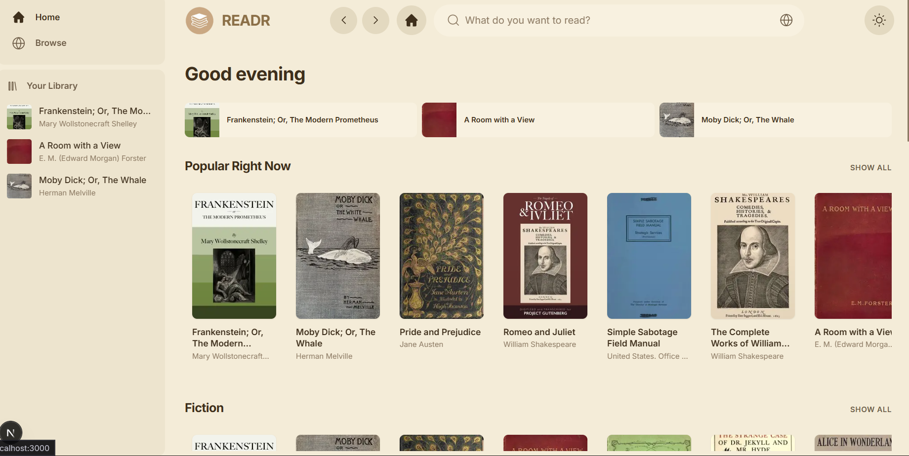
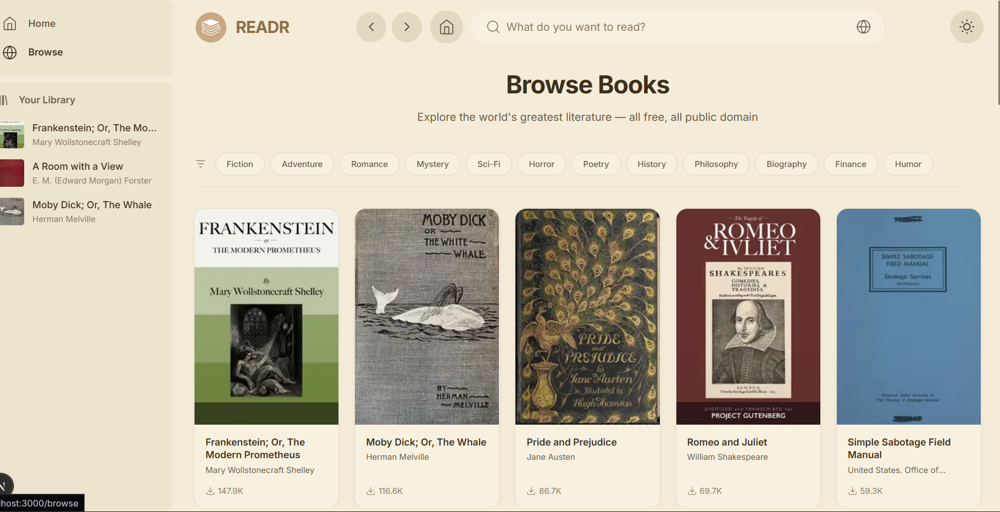
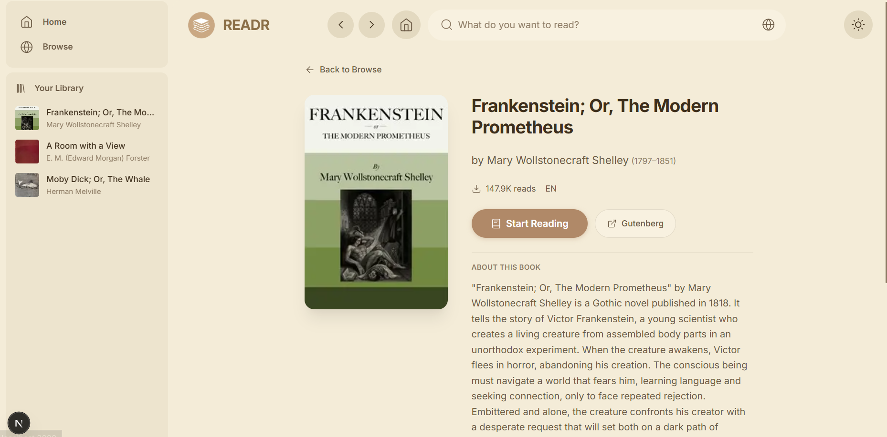
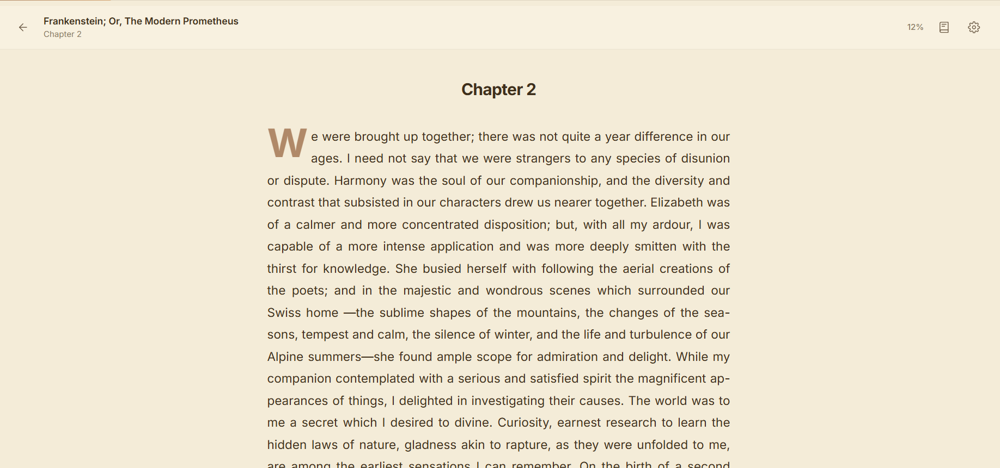

# READR — Free Public Domain Books

**A minimal, fast, and beautiful web app for reading over 77,000 public-domain books.** No sign-up, no paywall — just great typography and a distraction-free reader built for long-form reading.

[](https://nextjs.org)
[](https://react.dev)
[](./LICENSE)
[](https://www.gutenberg.org)

---

## What it is

READR connects you to **Project Gutenberg**’s full catalog through the [Gutendex API](https://gutendex.com). You can browse by genre, search by title or author, open any book, and read it in a dedicated reader with themes, font size controls, and automatic progress saving — all in the browser, with no account required.

The UI is inspired by modern reading and streaming apps: clean layout, clear hierarchy, and smooth but subtle animations so the content stays the focus.

---

## See it in action

Here’s a quick walkthrough of the app: from the home screen, through browse and search, to a book detail page and the reader.

| Step 1 — Home | Step 2 — Browse & search |
|---------------|--------------------------|
| Landing with greeting, continue reading, and curated rows (Popular, Fiction, Adventure, Poetry, Philosophy). | Browse by genre with infinite scroll, or use search to find books by title or author. |
|  |  |

| Step 3 — Book details | Step 4 — Reader |
|----------------------|-----------------|
| Cover, author, subjects, summary, and quick actions: Start Reading or open on Gutenberg. | Full-screen reader with progress bar, theme (dark/sepia), font size, table of contents, and chapter navigation. |
|  |  |

---

## Features

- **77,000+ books** — Full [Project Gutenberg](https://www.gutenberg.org) catalog via [Gutendex](https://gutendex.com); plain-text editions for reliable in-app reading.
- **Server-rendered first load** — Home, browse, and search fetch data on the server so the first paint is fast and SEO-friendly.
- **Smart caching** — Client-side cache with URL normalization and request deduplication; server-side LRU cache for book text so repeat visits and back navigation feel instant.
- **Reader built for long reads** — [Literata](https://fonts.google.com/specimen/Literata) for body text, adjustable font size (14–28px), dark and sepia themes, and a progress bar. Chapter detection handles common patterns (Chapter I, Book 1, Part One, etc.); fallback sectioning for untagged texts.
- **Progress and “Continue reading”** — Current book and chapter are saved in `localStorage`; the sidebar and home section show recently read books and let you jump back in.
- **Responsive layout** — Sidebar + main content on desktop; top bar and bottom nav on small screens. Touch-friendly controls and readable line lengths.
- **Accessibility** — Skip link, semantic HTML, ARIA where needed, keyboard-friendly reader (arrows for prev/next chapter, Escape to close panels).
- **Performance and resilience** — Timeouts and retries for external APIs; graceful fallbacks when a category or search fails; no hanging requests.

---

## Tech stack

| Layer | Choice |
|-------|--------|
| **Framework** | [Next.js 16](https://nextjs.org) (App Router) |
| **UI** | [React 19](https://react.dev) |
| **Styling** | Vanilla CSS with custom properties (design tokens in `globals.css`), CSS Modules per route/component |
| **Fonts** | [Inter](https://rsms.me/inter/) (UI) and [Literata](https://fonts.google.com/specimen/Literata) (reader) via `next/font` |
| **Motion** | [Framer Motion](https://www.framer.com/motion/) for page and panel transitions |
| **Data** | [Gutendex API](https://gutendex.com) for metadata and listing; Project Gutenberg for plain-text content (proxied via app API to avoid CORS) |
| **State / persistence** | React state + `localStorage` for theme, font size, and reading progress |

No database, no auth, no Tailwind — the goal was a small, readable stack that’s easy to run and extend.

---

## Project structure

```
read-a-book/
├── app/
│   ├── layout.js              # Root layout, fonts, theme script, shell (Sidebar, TopBar, MobileNav)
│   ├── page.js                # Home (SSR) → HomePageClient
│   ├── page.server.js         # getHomePageData() — parallel fetch for all featured rows
│   ├── globals.css             # Design tokens, themes, base styles
│   ├── error.js                # Global error boundary
│   ├── not-found.js            # 404 page
│   │
│   ├── api/
│   │   └── books/[id]/text/
│   │       └── route.js        # GET book plain text (proxy + server-side LRU cache, timeouts)
│   │
│   ├── browse/
│   │   ├── page.js            # Browse (SSR) → BrowseContent
│   │   ├── page.server.js     # getBrowsePageData(topic)
│   │   └── BrowseContent.jsx   # Client: filters, infinite scroll, cache hydration
│   │
│   ├── search/
│   │   ├── page.js            # Search (SSR when ?q=) → SearchContent
│   │   ├── page.server.js     # getSearchPageData(query)
│   │   └── SearchContent.jsx   # Client: debounced search, results grid
│   │
│   ├── book/[id]/
│   │   ├── page.js            # Book detail (client, fetchWithCache)
│   │   └── read/
│   │       └── page.js        # Reader: text fetch, chapters, TOC, theme, font size, progress
│   │
│   ├── components/             # Sidebar, TopBar, MobileNav, BookCard, ScrollRow, etc.
│   ├── hooks/                  # useTheme, useReadingProgress, useRecentlyRead, useRecentBooks
│   └── lib/
│       ├── api.js             # Gutendex helpers, parseBookText, getBookTextUrl, etc.
│       ├── apiCache.js        # Client cache (getCachedData, fetchWithCache, prefetch, setCachedData)
│       └── serverApi.js       # Server fetch with timeout + retry, getBooksParallel
│
├── public/                     # Static assets and UI screenshots (1.png, image2–4.png)
├── next.config.mjs             # Security headers, image domains (gutenberg, wikimedia)
├── CONTRIBUTING.md
├── LICENSE
└── README.md
```

---

## Getting started

**Prerequisites:** Node.js 18+ and npm (or equivalent).

```bash
git clone https://github.com/YOUR_USERNAME/read-a-book.git
cd read-a-book
npm install
npm run dev
```

Open [http://localhost:3000](http://localhost:3000). No env vars are required; the app talks to public APIs only.

**Production build:**

```bash
npm run build
npm start
```

**Lint:**

```bash
npm run lint
```

---

## Design and UX notes

- **Themes** — Dark (default) and sepia; stored in `localStorage` and applied before paint to avoid flash.
- **Reader typography** — Single book-style font (Literata) for body and drop cap; chapter titles stay in the UI font for hierarchy.
- **Loading states** — Skeletons on list and detail; reader shows a skeleton while book text is loading. Cached data is used when available to avoid unnecessary spinners on back navigation.
- **Error handling** — Failed API calls show clear messages and retry options; the global error boundary catches runtime errors and offers “Try again.”

---

## Contributing

Contributions are welcome. Please read [CONTRIBUTING.md](./CONTRIBUTING.md) for how to propose changes and submit patches.

---

## License

This project is licensed under the **MIT License** — see [LICENSE](./LICENSE) for the full text.

---

## Acknowledgments

- [Project Gutenberg](https://www.gutenberg.org) for preserving and providing public-domain texts.
- [Gutendex](https://gutendex.com) for the free JSON API over Gutenberg metadata.

---

## Is it GitHub-portfolio ready?

| Criteria | Status |
|----------|--------|
| **README** | ✅ Clear hero, badges, walkthrough with screenshots, features, stack, structure, and run instructions |
| **Screenshots** | ✅ Four-step UI flow (home → browse → detail → reader) in `public/` and linked in README |
| **Code quality** | ✅ Consistent patterns, error handling, timeouts, and cache strategy; see `CODE_AUDIT.md` if present for a deeper review |
| **Run from clone** | ✅ `npm install` + `npm run dev` with no secrets or env required |
| **License** | ✅ MIT + CONTRIBUTING.md |


